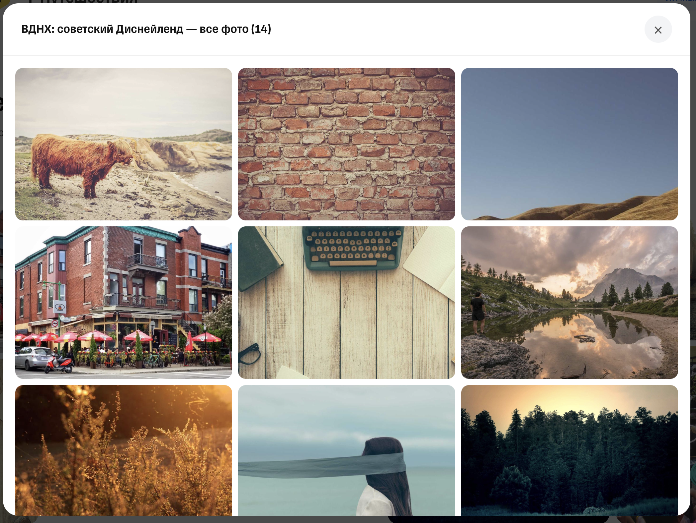
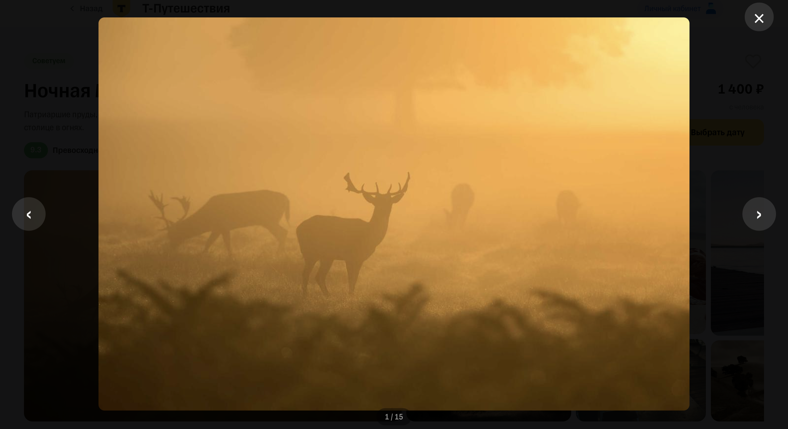

# React Adaptive Photo Gallery

## Preview

<p align="center">
  
  <br />
  
  <br />
  
  
</p>

An adaptive React component for image galleries with dynamic aspect-ratio layout calculations, a full-screen lightbox, and a responsive view-all modal.

## Features
- 📐 **Dynamic Layout:** Automatically calculates column widths and cell flex values based on image ratios.
- 🔍 **Interactive Lightbox:** Full-screen image preview with keyboard navigation (Arrow keys and Escape).
- 🖼️ **"View All" Modal:** Grid modal for browsing all uploaded photos when the total count exceeds the display limit.
- 📱 **Fully Responsive:** Smooth layout adjustments across mobile, tablet, and desktop breakpoints.

## Installation

```bash
npm install react-photo-gallery-adaptive
```

## Quick Start

```bash
npm install react-photo-gallery-adaptive
```

```jsx
import React from "react";
import PhotoGallery from "react-photo-gallery-adaptive";

const photos = [
  "https://picsum.photos/800/600",
  "https://picsum.photos/600/800",
  "https://picsum.photos/800/800",
  "https://picsum.photos/1200/800",
];

export default function App() {
  return (
    <div style={{ maxWidth: 1000, margin: "0 auto", padding: 24 }}>
      <PhotoGallery photos={photos} title="Vacation Photos" />
    </div>
  );
}
```

## Using in another React app

After publishing to npm, other developers install it the same way:

```bash
npm install react-photo-gallery-adaptive
```

Then they import it in their app:

```jsx
import PhotoGallery from "react-photo-gallery-adaptive";
```

The repo itself is used for development and demo testing, while npm is used for real app integration.

## Local demo

```bash
npm install
npm run dev
```

Then open the local URL shown by Vite in the browser.
